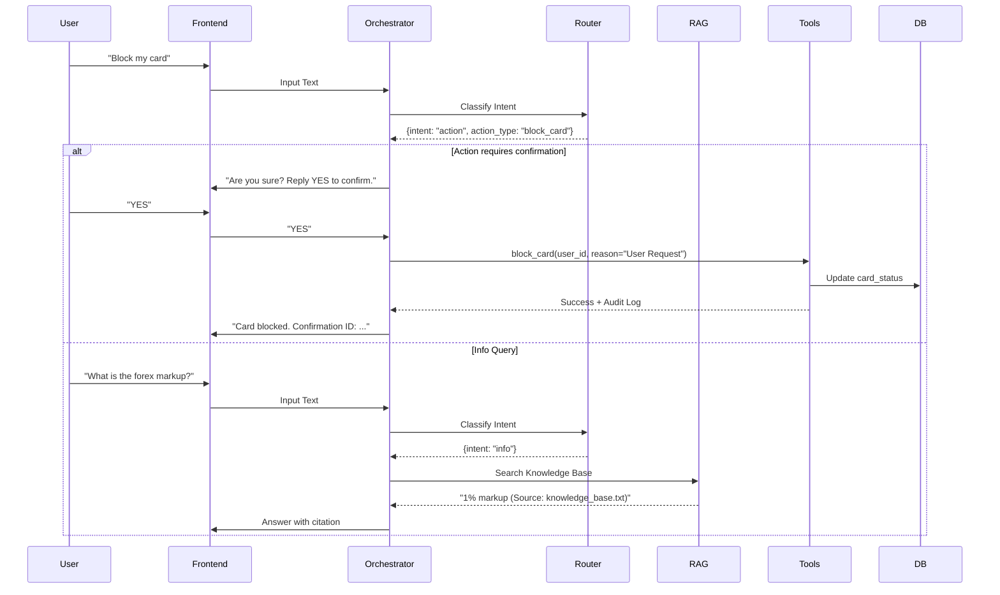

# Orchestrator Design

This directory contains the design and configuration for the OneCard Assistant's LLM orchestration layer.

## Overview
The orchestrator acts as the central brain, routing user intents to either the RAG module (for information) or the Action module (for account operations). It enforces security policies, requires confirmation for destructive actions, and ensures consistent persona behavior.

## Security Assumptions
1.  **Authenticated Session**: The agent operates within an authenticated user session.
2.  **User Context**: A valid `user_id` is available in the context for all tool calls.
3.  **Secure Channel**: Communication between the user and the agent is over a secure channel.

## Runtime Sequence Diagram

